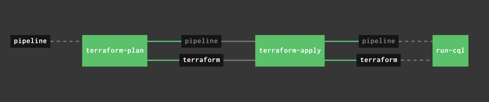

# Demo of Astra DevOps APIs in concourse pipeline

Thanks to the [startship-enterprise](https://github.com/michelderu/starship-enterprise) demo created by my colleagues at DataStax for the terraform inspiration. 

Currently there are a lot of assumption about the knowledge required to run this demonstration. We'll improve and add more detail over time. There are 2 parts to this demo: 

1. Terraform script - to provision the Astra DB which would include any security (IP lists, private links, custom roles) and keyspace information.
1. Astra cql script - to configure the data model


The idea is to coordinate these 2 basic tasks above in a more comprehensive CI/CD automation and leverage Infrastrucure As Code to bring speed and consistency in all deployments. In this demo we use concourse pipeline automates the process. 



## Requirements
Currently there is an expecation that the links below would be sufficient to setup the environment. It is primarily concourse that is currently deployed in kubernetes. For a local environment with a powerful enough machine you can use docker with kind.

* [kind](https://kind.sigs.k8s.io/) to run a local kubernetes cluster
* [https://concourse-ci.org/](concourse-ci) used to manage the CI/CD automation
* [https://www.terraform.io/](terraform) for Infrastructure As Code
* [https://registry.terraform.io/providers/datastax/astra/latest](Astra terraform provider)
* Configure terraform to use an [https://www.terraform.io/docs/language/state/remote-state-data.html](remote state data source). You can find details on how to setup the [https://docs.microsoft.com/en-us/azure/developer/terraform/store-state-in-azure-storage?tabs=azure-cli](terraform state store in Azure storage) link.

### Running Kind
We are using [kind](https://kind.sigs.k8s.io/) to run concourse

```
$ kind create cluster --config kind-config.yaml --name concourse
$ kubectl cluster-info --context kind-concourse
```

### Running Concourse
We are running concourse in the local kind kubernetes cluster

*NOTES:
* Concourse can be accessed:

  * Within your cluster, at the following DNS name at port 8080:

    my-release-web.default.svc.cluster.local

  * From outside the cluster, run these commands in the same shell:

    export POD_NAME=$(kubectl get pods --namespace default -l "app=my-release-web" -o jsonpath="{.items[0].metadata.name}")
    echo "Visit http://127.0.0.1:8080 to use Concourse"
    kubectl port-forward --namespace default $POD_NAME 8080:8080

You can then download the *fly* CLI and create a target for your concourse deployment:
```
$ fly -t local login -c http://127.0.0.1:8080/ -u test -p test
```

## Running Terraform locally
You can run terraform locally, though this current version is configure to use the [azurerm](remote backend).

```
$ export ARM_ACCESS_KEY=YOUR_ACCESS_KEY
$ cd terraform 
$ terraform init
$ terraform plan -var-file="../SECRETS/terraform.tfvars"
```

## Deploying your pipeline
All secrets are provided as environment variable to the pipeline. We would typicaly store them in a secrets store.

```
$ export ARM_ACCESS_KEY=YOUR_ACCESS_KEY
$ export ASTRA_TOKEN=YOUR_ASTRA_TOKEN
$ export ASTRA_CLIENT_ID=YOUR_ASTRA_CLIENT_ID
$ export ASTRA_CLIENT_SECRET=YOUR_ASTRA_CLIENT_SECRET

$ cd pipeline
$ fly -t local set-pipeline -p astra-devops --config pipeline.yml --var "astra_token=$ASTRA_TOKEN" --var "astra_client_id=$ASTRA_CLIENT_ID" --var "astra_client_secret=$ASTRA_CLIENT_SECRET" --var "arm_access_key=$ARM_ACCESS_KEY" --load-vars-from vars.yml
```


